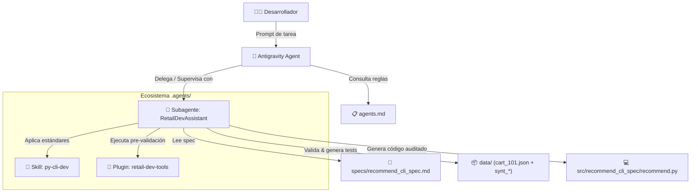

# 🛒 Antigravity (AGY) Demo — Retail AI Workspace

Bienvenido al repositorio base de demostración de **Antigravity (AGY)** enfocado en la industria de Retail. Este proyecto está diseñado para mostrar a equipos de desarrollo cómo estructurar y gobernar flujos de trabajo asistidos por IA mediante **Custom Skills**, **Plugins**, **Subagentes (Subagents)** y **Reglas de Gobernanza (`agents.md`)**.

---

## 📖 Tabla de Contenidos
1. [Visión General y Conceptos Clave](#-visión-general-y-conceptos-clave)
   - [Custom Skills](#1-custom-skills-skills)
   - [Plugins](#2-plugins-plugins)
   - [Subagents](#3-subagents-agents)
   - [Workspace Manifest / Reglas (`agents.md`)](#4-workspace-manifest-agentsmd)
2. [Estructura del Repositorio](#-estructura-del-repositorio)
3. [Objetivo del Proyecto](#-objetivo-del-proyecto-la-app-del-spec)
4. [Flujo de Trabajo del Subagente en Antigravity](#-flujo-de-trabajo-del-subagente-en-antigravity)
5. [Cómo Ejecutar la Tarea en Antigravity](#-cómo-ejecutar-la-tarea-en-antigravity)
6. [Validación y Ejecución Manual](#-validación-y-ejecución-manual)

---

## 🧠 Visión General y Conceptos Clave

Antigravity proporciona un entorno donde los agentes de desarrollo no operan a ciegas, sino bajo un marco estricto de arquitectura, herramientas de verificación y roles especializados.



### 1. Custom Skills (`.agents/skills/`)
- **¿Qué son?**: Módulos de conocimiento y directrices que definen *el cómo* debe construirse una solución. Se configuran mediante un archivo `SKILL.md` con metadata YAML y reglas concretas.
- **En este repo (`.agents/skills/py-cli-dev/SKILL.md`)**:
  - Parámetros por línea de comando (`sys.argv[1]`).
  - Uso obligatorio del SDK oficial de Google: `google-genai`.
  - Uso del modelo `gemini-3.8-flash`.
  - Respuestas estructuradas en JSON (`response_mime_type="application/json"`).
  - Generación de archivos de salida con sufijo `_out` y marca de tiempo (`timestamp`).

### 2. Plugins (`.agents/plugins/`)
- **¿Qué son?**: Extensiones que exponen herramientas y scripts locales deterministas que el agente o el desarrollador pueden ejecutar para realizar tareas operativas, pre-validaciones o diagnósticos.
- **En este repo (`.agents/plugins/retail-dev-tools/`)**:
  - Definido en `plugin.json`.
  - Comando: `validate-cart-schema`.
  - Script ejecutable: `scripts/validate_cart.py`.
  - Función: Valida que los JSON de entrada contengan las llaves obligatorias (`cart_id`, `items`) y el formato esperado antes de cualquier procesamiento con el LLM.

### 3. Subagents (`.agents/agents/`)
- **¿Qué son?**: Agentes especializados definidos con su propio perfil (`agent.md`), rol, modelo preferido, system prompt y un conjunto de skills y plugins preasignados.
- **En este repo (`.agents/agents/RetailDevAssistant/agent.md`)**:
  - Rol: **Tech Lead / Supervisor Técnico de Retail**.
  - Responsabilidad: Auditar que el código cumpla los estándares de arquitectura, exigir el uso del plugin de validación de carritos antes de ejecutar el modelo y rechazar implementaciones que no sigan las directrices oficiales.

### 4. Workspace Manifest (`agents.md`)
- **¿Qué es?**: El contrato global a nivel de repositorio. Cualquier agente que opere en el workspace está obligado a leer y respetar estas directivas.
- **Reglas del proyecto**:
  1. Escribir código exclusivamente en `src/<caso_de_uso>/`.
  2. Enfocarse en un único caso de uso a la vez (siguiendo su archivo de especificación en `specs/`).
  3. Ejecutar pruebas con al menos **3 casos** en `data/`. Si no hay datos suficientes, generar casos sintéticos prefijados con `synt_`.

---

## 📂 Estructura del Repositorio

```text
agy-demo-inventory/
├── .agents/                               # Configuración de Antigravity
│   ├── agents/
│   │   └── RetailDevAssistant/
│   │       └── agent.md                   # Definición del subagente Tech Lead
│   ├── plugins/
│   │   └── retail-dev-tools/
│   │       ├── plugin.json                # Manifiesto del plugin
│   │       └── scripts/
│   │           └── validate_cart.py       # Script de validación de carritos
│   └── skills/
│       └── py-cli-dev/
│           └── SKILL.md                   # Reglas de arquitectura Python + Gemini
├── agents.md                              # Reglas globales de operación del workspace
├── data/
│   └── cart_101.json                      # Carrito de compras de ejemplo
├── specs/
│   ├── README.md
│   └── recommend_cli_spec.md              # Especificación del caso de uso a desarrollar
├── src/                                   # Código fuente generado (organizado por caso de uso)
└── README.md                              # Documentación general del proyecto (este archivo)
```

---

## 🎯 Objetivo del Proyecto: La App del Spec

El objetivo del desarrollador es implementar la aplicación de línea de comandos descrita en [`specs/recommend_cli_spec.md`](specs/recommend_cli_spec.md):

- **Archivo principal**: `src/recommend_cli_spec/recommend.py`.
- **Funcionalidad**:
  1. Recibir por argumento CLI la ruta a un archivo JSON que contiene un carrito de compra (`python recommend.py <ruta_json>`).
  2. Validar la estructura del carrito utilizando la herramienta del plugin.
  3. Enviar el contenido del carrito a **Gemini** (`gemini-3.8-flash`) usando el SDK `google-genai` para obtener recomendaciones de productos complementarios (venta cruzada / *cross-selling*).
  4. Guardar la recomendación generada en un archivo de salida `<nombre>_out.json` en el mismo directorio, con formato JSON estructurado y campo `timestamp`.
  5. Asegurar la cobertura de pruebas ejecutando y validando al menos 3 carritos (creando `synt_cart_102.json` y `synt_cart_103.json` en `data/`).

---

## 🔄 Flujo de Trabajo del Subagente en Antigravity

Cuando le pides a Antigravity que desarrolle el caso de uso, el subagente `RetailDevAssistant` opera de la siguiente manera:

1. **Lectura de Gobernanza**: Lee `agents.md` para acatar las reglas de carpetas (`src/<spec_id>/`) y la regla de las 3 pruebas.
2. **Carga de Especialización**: Se activa con el prompt de Tech Lead y la skill `py-cli-dev`.
3. **Generación de Casos Sintéticos**: Revisa `data/`, detecta que solo existe `cart_101.json` y crea dos casos sintéticos adicionales: `data/synt_cart_102.json` y `data/synt_cart_103.json`.
4. **Pre-validación**: Ejecuta `python .agents/plugins/retail-dev-tools/scripts/validate_cart.py` sobre los 3 archivos para garantizar que cumplen el contrato.
5. **Implementación de Código**: Escribe `src/recommend_cli_spec/recommend.py` siguiendo las reglas del SDK `google-genai`, configuración de modelo y manejo de JSON.
6. **Ejecución y Pruebas**: Ejecuta el CLI para los 3 carritos y comprueba que se hayan creado los correspondientes archivos `_out.json`.

---

## 🚀 Cómo Ejecutar la Tarea en Antigravity

En la consola o interfaz de chat de **Antigravity**, simplemente proporciona una instrucción como la siguiente:

```text
Lee agents.md y la especificación en specs/recommend_cli_spec.md.
Utiliza al subagente RetailDevAssistant para construir la solución completa en src/recommend_cli_spec/recommend.py,
validar los datos con retail-dev-tools, generar los datos de prueba sintéticos requeridos en data/ y ejecutar las 3 pruebas.
```

### ¿Qué sucederá automáticamente?
- Antigravity delegará o asumirá el rol de **`RetailDevAssistant`**.
- El subagente aplicará la skill **`py-cli-dev`** para garantizar buenas prácticas de código.
- Llamará al script del plugin **`retail-dev-tools`** para validar los JSONs.
- Creará los archivos `synt_*.json` y el script en `src/recommend_cli_spec/recommend.py`.
- Ejecutará las pruebas y te entregará el reporte final de cumplimiento.

---

## 🛠️ Validación y Ejecución Manual

Si deseas probar manualmente las herramientas o la aplicación una vez generada:

### 1. Requisitos previos
Configura tu entorno de Python y la variable de entorno de Gemini:
```bash
python3 -m venv .venv
source .venv/bin/activate
pip install google-genai
gcloud auth application-default login
```

### 2. Probar la herramienta del plugin
```bash
python .agents/plugins/retail-dev-tools/scripts/validate_cart.py data/cart_101.json
```
*Salida esperada:*
```text
✅ Esquema válido: El carrito cumple con la estructura requerida.
```

### 3. Probar el recomendador CLI (una vez implementado)
```bash
python src/recommend_cli_spec/recommend.py data/cart_101.json
```
*Salida esperada:*
Genera el archivo `data/cart_101_out.json` con las recomendaciones estructuradas y el timestamp.
